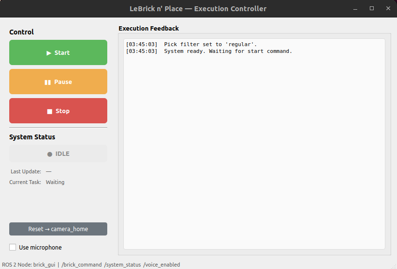
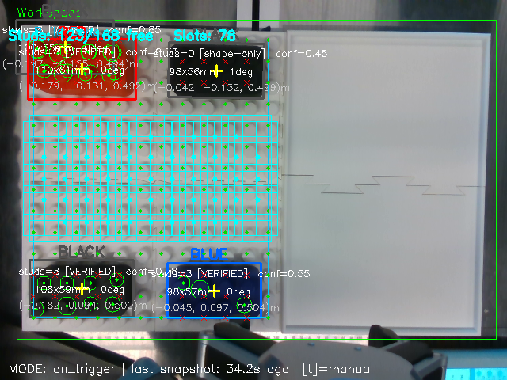

# LeBrick n' Place

A vision-guided pick-and-place system that uses the UR3e robotic arm to detect, sort, and arrange LEGO bricks by colour and size into predefined designs.

> **41069 Robotics Studio 2** -- University of Technology Sydney  
> Team: **LeBrick James**  
> Client: Isira Wijegunawardana | Coach: Katie Powell

| Name | Student ID | Role |
|------|-----------|------|
| Danish Silva | 24638001 | Perception & Mapping |
| Hari Mahadevan | 24801045 | Interaction & Execution |
| Benjamin Costarella | 24834727 | Motion Planning & Control |
| Dheeraj Panjwani | 14275073 | Voice Interface & HRI |

---

## Project Overview

LeBrick n' Place is a ROS2-based vision-guided pick-and-place system that uses the UR3e robotic arm to detect, sort, and arrange custom LEGO bricks onto the placement board. Utilising an overhead Intel RealSense D435i depth camera, the system identifies the bricks colour, size, and pose, allowing the UR3e to pick-and-place them in the users desired arrangement. Users interact through a GUI that supports colour sorting, size sorting, horizontal/vertical placement, and preset build designs.

### Subsystems

| Subsystem | Package | Lead | Description |
|-----------|---------|------|-------------|
| Perception & Mapping | `brick_vision` | Danish Silva | Brick detection, colour/size classification, and 3D pose estimation via RealSense + OpenCV |
| Motion Planning & Control | `ur3e_motion_mtc` | Benjamin Costarella | Performs Inverse Kinematics, trajectory planning, singularity & obstacle avoidance using MoveIt2 to plan and execute pick-and-place tasks |
| Interaction & Execution | `brick_interaction` & `brick_gui` | Hari Mahadevan | Task sequencing & state machine (idle / running / paused / stopped / completed / error); Qt-based GUI with mode selection (closest large / small / red / green), start–pause–stop–reset controls, voice toggle, and live status; camera→base_link frame transform bridge feeding the motion subsystem; coordination of pick/place hand-offs and snapshot cycle triggering |
| Voice Interface | Task Level Control via Voice Interface| Dheeraj Panjwani | Voice commands via microphone for system control and task selection |

### System Architecture

```
+---------------------+   +--------------------+   +-------------------------+   +---------------------+
|   Perception &      |-->| frame_transform_   |-->|   Interaction &         |-->|   Motion Planning   |
|   Mapping           |   |   node             |   |   Execution             |   |   & Control         |
|   (brick_vision)    |   | (camera->base_link |   |   (brick_interaction    |   |   (ur3e_motion_mtc) |
+---------------------+   |  via tf2)          |   |    + brick_gui)         |   +---------------------+
   Intel RealSense        +--------------------+   |   state machine,        |       UR3e + MoveIt2
   OpenCV + Depth                                  |   GUI, pick filters,    |       Task Constructor
                                                   |   stop / reset path     |       (snapshot trigger
                                                   +-------------------------+        publishes back
                                                                  ^                  to perception)
                                                                  |
                                                        +---------------------+
                                                        |   Voice Interface   |
                                                        | (Microphone + ROS2) |
                                                        +---------------------+
```


---

## Repository Structure

```
BrickPickNPlace-RS2/
├── src/
│   ├── brick_vision/          # Perception & mapping (RealSense + OpenCV)
│   │   ├── CMakeLists.txt
│   │   ├── README.md
│   │   ├── package.xml
│   │   ├── launch/
│   │   │   └── brick_detection.launch.py
│   │   ├── config/
│   │   │   └── workspace_calibration.json
│   │   └── brick_vision/
│   │       ├── __init__.py
│   │       └── brick_detector.py
│   ├── brick_gui/             # User interface
│   │   ├── CMakeLists.txt
│   │   ├── README.md
│   │   ├── package.xml
│   │   ├── launch/
│   │   │   └── brick_gui.launch.py
│   │   ├── resource/
│   │   └── brick_gui/
│   │       ├── __init__.py
│   │       ├── gui_node.py
│   │       └── ui/
│   │           └── main_window.ui
│   ├── brick_interaction/     # Task sequencing & execution logic
│   │   ├── CMakeLists.txt
│   │   ├── README.md
│   │   ├── package.xml
│   │   ├── launch/
│   │   │   ├── brick_interaction.launch.py
│   │   │   └── system.launch.py
│   │   ├── resource/
│   │   └── brick_interaction/
│   │       ├── __init__.py
│   │       ├── brick_sorter.py
│   │       ├── frame_transform_node.py
│   │       ├── pose_transform_test.py
│   │       ├── motion_client.py
│   │       ├── gripper_client.py
│   │       ├── interaction_node.py
│   │       ├── state_machine.py
│   │       └── __pycache__/
│   ├── ur3e_motion_mtc/       # Motion planning (MoveIt2 Task Constructor)
│   │   ├── CMakeLists.txt
│   │   ├── README.md
│   │   ├── README.pdf
│   │   ├── package.xml
│   │   ├── launch/
│   │   │   └── ur3e_motion_mtc.launch.py
│   │   └── src/
│   │       └── ur3e_motion_mtc.cpp
│   └── voice_interface/       # Voice & keyboard command interface
│       ├── package.xml
│       └── voice_interface/
│           ├── voice_input_node.py
│           ├── command_parser_node.py
│           ├── system_command_listener.py
│           └── reset_executor_node.py
├── .gitignore
└── README.md
```

---

## Dependencies

### Hardware

| Component | Details |
|---|---|
| Robot | Universal Robots UR3e |
| Gripper | OnRobot RG2 |
| Camera | Intel RealSense D435i |
| LEGO Bricks | LeBrick n' Place Custom LEGO Bricks |
| LEGO Board | LeBrick n' Place Custom LEGO Board |

### Software

| Component | Version |
|---|---|
| Operating System | Ubuntu 22.04 |
| ROS2 | Humble Hawksbill |
| MoveIt2 | 2.5.9 |
| MoveIt Task Constructor | 0.1.3 |
| RViz2 | 11.2.26 |
| Python | 3.10+ |
| C++ | 17 |

---

## Installation

### Hardware Setup

| Component | Details |
|-----------|---------|
| Robot | UR3e with gripper attachment |
| Camera | Intel RealSense D435i, mounted overhead on a fixed stand |
| Workspace | White LEGO base plate |
| Bricks | Large LEGO bricks (4x2 = 100mm x 50mm, 15mm studs) |
| Microphone | Computer headset or USB microphone |

### Software

**1. Install build tools, ROS2 packages, and MoveIt Task Constructor:**
```bash
sudo apt update
sudo apt install -y \
  python3-colcon-common-extensions \
  python3-rosdep \
  ros-humble-moveit \
  ros-humble-ur-robot-driver \
  ros-humble-cv-bridge \
  ros-humble-moveit-task-constructor-*
```

**2. Install Python packages:**
```bash
pip install opencv-python pyrealsense2 numpy SpeechRecognition pyaudio
```

> If `pip install pyaudio` fails, install the system dependency first:
> ```bash
> sudo apt install portaudio19-dev
> pip install pyaudio
> ```

**3. Initialise rosdep:**
```bash
sudo rosdep init
rosdep update
```

**4. Clone the repository:**
```bash
git clone https://github.com/DanishUTS/BrickPickNPlace-RS2.git
cd BrickPickNPlace-RS2
```

**5. Install workspace dependencies:**
```bash
rosdep install --from-paths src --ignore-src -r -y
```

**6. Build the workspace:**
```bash
source /opt/ros/humble/setup.bash
colcon build
source install/setup.bash
```

---

## Launch Commands

The application stack (vision + frame-transform bridge + motion planning + interaction + GUI) is bundled into a single launch file, so only **five terminals** are needed in total — three for the system and two more for optional voice control.

### Terminal 1 — UR driver (real robot)

Connects to the physical UR3e at `192.168.0.194`. After this launches, load `external_control.urp` on the pendant and press ▶ Play; you should see *"Robot connected to reverse interface."* in this terminal.

```bash
source /opt/ros/humble/setup.bash
source install/setup.bash
ros2 launch ur_onrobot_control start_robot.launch.py \
  ur_type:=ur3e \
  onrobot_type:=rg2 \
  robot_ip:=192.168.0.194 \
  launch_rviz:=false
```

For sim testing without the physical robot:

```bash
ros2 launch ur_onrobot_control start_robot.launch.py \
  ur_type:=ur3e \
  onrobot_type:=rg2 \
  use_fake_hardware:=true \
  launch_rviz:=false
```

### Terminal 2 — MoveIt + RViz

Wait until Terminal 1 reports active controllers (`scaled_joint_trajectory_controller`, `finger_width_trajectory_controller`).

```bash
source /opt/ros/humble/setup.bash
source install/setup.bash
ros2 launch ur_onrobot_moveit_config ur_onrobot_moveit.launch.py \
  ur_type:=ur3e \
  onrobot_type:=rg2 \
  launch_rviz:=true
```

### Terminal 3 — Application stack (bundled)

Brings up `brick_vision`, `frame_transform_node` (camera → base_link tf2 bridge), `ur3e_motion_mtc`, `brick_interaction_node`, and the GUI in dependency order with timed delays (~30 s to fully come up).

```bash
source /opt/ros/humble/setup.bash
source install/setup.bash
ros2 launch brick_interaction system.launch.py
```

When the GUI window appears, pick a pick mode (closest large / small / red / green), then use **Start / Pause / Stop / Reset → camera_home** to drive the cycle. The microphone toggle gates the voice path described below.

### Terminal 4 — Voice Input Node (optional)

Captures microphone audio and publishes raw transcripts on `/voice_command_raw`. The microphone keeps listening continuously — the GUI's "Use microphone" checkbox gates whether commands are forwarded.

```bash
source /opt/ros/humble/setup.bash
source install/setup.bash
ros2 run voice_interface voice_input_node
```

### Terminal 5 — Voice Command Parser Node (optional)

Parses transcripts into system commands (`start`, `pause`, `stop`, `reset`, `home`, colour/brick-size keywords) and publishes them on `/brick_command`. Subscribes to `/voice_enabled` (published by the GUI checkbox) and silently drops parsed commands when the mic is gated off.

```bash
source /opt/ros/humble/setup.bash
source install/setup.bash
ros2 run voice_interface command_parser_node
```

---

## Demo and System Images

### Demonstration Video

[](https://youtube.com/shorts/HnnYeVQIz8Y)

### GUI Screen



### Robot Setup


### Camera Vision



---

# brick_vision — Perception & Mapping


ROS 2 package for detecting LEGO bricks and analysing a build plate using an **Intel RealSense D435i** depth camera and **OpenCV**. Identifies bricks by their stud pattern, classifies colour, estimates 3D pose, and finds available placement slots on a 12×14-stud build zone.

---

## What the node does

For each captured frame the pipeline runs three stages:

1. **Brick detection** — find 4×2 LEGO bricks in the workspace ROI, identify their colour, compute centre + yaw in 3D camera coordinates.
2. **Build-zone analysis** — locate the 14-row × 12-column stud grid on the build plate, decide which studs are free vs occupied, slide a 4×2 window over the grid to find legal placement slots (with a 1-stud gap rule).
3. **Publish results** — bricks, free studs, and available slots are all published on dedicated topics for the interaction node to consume.

```
Camera ── stud blob detection ── size validation ── grid grouping ── 4×2 match
                                                                       │
                                                                       ▼
                                                          colour + pose + confidence
                                                                       │
                                                                       ▼
Build-zone ──► studs_px (14×12) ──► occupancy (4×2 oriented-box test) ──► slot search
```

### Two operating modes

| Mode | When to use | Frame rate |
|---|---|---|
| `on_trigger` (default) | Production. Vision waits for an `std_msgs/Empty` on `/snapshot_trigger` (e.g. when the arm reaches home and the workspace is clear), takes 5 frames, keeps the best one, publishes once. Results are **latched** so late subscribers immediately get the most recent snapshot. | Event-driven |
| `continuous` | Debug / tuning. Runs detection at ~15 Hz the whole time. | ~15 Hz |

### Two-stage calibration

Both calibrations are interactive (clicks in the OpenCV window) and saved to `~/.brick_vision/workspace_calibration.json`.

| Calibration | Trigger | What you click |
|---|---|---|
| **Workspace ROI** | `c` key | Drag a rectangle around the table area the camera should look at. Surface depth is sampled inside the ROI. |
| **Build-zone grid** | `b` key | Click the *top-left* stud centre, then the *bottom-right* stud centre, of the 12×14 build plate. The 168-stud grid is linearly interpolated between them. |

---

## ROS 2 interface

### Parameters

| Parameter | Default | Description |
|---|---|---|
| `mode` | `"on_trigger"` | `"on_trigger"` or `"continuous"` |
| `trigger_topic` | `"/snapshot_trigger"` | Topic name to subscribe to in `on_trigger` mode |
| `snapshot_frames` | `5` | Capture N frames per trigger, publish the best one |
| `show_preview` | `true` | Show the OpenCV window. Set `false` for headless runs |

### Subscribed topics

| Topic | Type | Description |
|---|---|---|
| `/snapshot_trigger` | `std_msgs/Empty` | (on_trigger mode only) Take one snapshot now. Topic name is overridable via the `trigger_topic` parameter. |

### Published topics

All published under the node namespace `/brick_detector/`. In `on_trigger` mode the four result topics use **`TRANSIENT_LOCAL`** QoS (latched, depth 1) — a subscriber that starts after a snapshot immediately receives the most recent result.

| Topic | Type | Purpose |
|---|---|---|
| `~/detection_image` | `sensor_msgs/Image` | Annotated camera frame: brick boxes + colour labels, build-zone perimeter, free studs (green dots), occupied studs (red X), available 4×2 slots (cyan rectangles), status line. Not latched. |
| `~/detections` | `vision_msgs/Detection3DArray` | **All** detected bricks (pickup + placed). Useful for rviz / debugging. One entry per brick, binding `pose + size + colour + confidence`. Pose orientation encodes yaw as a quaternion (roll/pitch = 0). Colour string is in `results[0].hypothesis.class_id`. |
| `~/pickup_detections` | `vision_msgs/Detection3DArray` | **Main consumer topic for the interaction node.** Only bricks whose pixel centre falls *outside* the calibrated build-zone rectangle — i.e. bricks waiting to be picked. Same message structure as `~/detections`. If the build zone isn't calibrated, this is identical to `~/detections`. |
| `~/placed_detections` | `vision_msgs/Detection3DArray` | Bricks already on the build plate (pixel centre inside the build-zone rectangle, ½-stud margin). Diagnostic only — the interaction node should ignore these. |
| `~/brick_pose` | `geometry_msgs/PoseStamped` | Convenience — first **pickup-side** brick only. Use `~/pickup_detections` for real consumption. |
| `~/free_studs` | `geometry_msgs/PoseArray` | Centre of every free stud on the 12×14 grid. Diagnostic. |
| `~/available_slots` | `geometry_msgs/PoseArray` | **Placement-target topic.** Midpoint of each legal 4×2 area (free + 1-stud gap respected). Orientation encodes the slot's yaw (long axis along X vs Y). |

All headers stamp `frame_id = "camera_color_optical_frame"` — consumers should transform to `base_link` via `tf2`.

---

## Brick detection details

### Pipeline

1. **Capture** — RealSense streams aligned colour + depth at 640×480 @ 30 fps.
2. **Workspace ROI** — Crop to the calibrated rectangle (border pixels excluded).
3. **HSV pre-segmentation** — Build colour masks for the supported colour set.
4. **Contour extraction + size check** — Keep contours whose oriented bounding box has the right aspect ratio (2:1 ± 35 %) and metric size (~100×50 mm ± 30 %).
5. **Stud verification (HoughCircles)** — Inside each candidate, find circular studs and check there are roughly 8 of them at the expected spacing.
6. **Pose + yaw** — Centre from contour moments, yaw from the oriented box, Z from median depth in a small window.
7. **Confidence** — `0.65 max` from colour+size, plus `0.35 bonus` if ≥ 2 verified studs were found (total ≤ 1.0).

### Supported colours

| Colour | HSV ranges |
|---|---|
| Red | hue 0–10 + 170–179 |
| Orange | hue 11–25 |
| Yellow | hue 26–34 |
| Green | hue 35–85 |
| Blue | hue 86–130 |
| Purple | hue 131–169 |
| Black | V < 60, S < 120 |

White is intentionally excluded — the workspace surface is white.

### Per-brick output dictionary (internal)

```python
{
    "center_px":    (320, 240),           # pixel coordinates
    "center_3d":    [0.05, -0.02, 0.35],  # metres, camera frame
    "size_px":      (80, 40),
    "size_m":       (0.098, 0.049),
    "angle":        45.0,                 # degrees, used as yaw
    "colour":       "orange",
    "colour_bgr":   (0, 140, 255),
    "stud_count":   8,
    "brick_config": (4, 2),
    "confidence":   0.92,
}
```

These get repackaged into `vision_msgs/Detection3DArray` when published.

---

## Build-zone analysis

### Geometry

- **Grid**: 12 columns × 14 rows of studs (168 studs total).
- **Stud pitch**: 25 mm centre-to-centre (matches LEGO spec).
- **Brick footprint**: 4×2 studs (the only size currently used).
- **Placement gap rule**: every placed brick needs **1 row + 1 column of free studs around it** before another brick can be placed.

### How occupancy is decided

For each detected brick the node builds an oriented bounding box on the image, then checks every stud's pixel position against that box (using a rotated-coords inside-test). Studs falling inside any brick's footprint are marked occupied; everything else is free.

### How slots are found

A sliding window scans both orientations (4×2 and 2×4) across the grid. A slot is *available* iff:

- All 8 studs inside the window are free.
- Every stud in the surrounding 1-stud ring is either free or outside the grid (the gap-ring check).

The midpoint of each accepted slot, plus its orientation (yaw 0 or π/2), is published in `~/available_slots`.

### `analyze_buildzone()` return value

```python
{
    "studs_px":    np.ndarray,   # (14, 12, 2)  pixel positions
    "studs_3d":    np.ndarray,   # (14, 12, 3)  metres, camera frame
    "occupancy":   np.ndarray,   # (14, 12)     bool
    "free_studs":  [ {"row":r, "col":c, "px":(x,y), "xyz":(x,y,z)}, ... ],
    "slots":       [ {"row":r, "col":c, "long_axis":"x"|"y",
                      "yaw":0.0|π/2, "xyz":(x,y,z)}, ... ],
}
```

---

## Usage

### Build

```bash
cd ~/git/BrickPickNPlace-RS2
colcon build --packages-select brick_vision
source install/setup.bash
```

### Run (on_trigger mode, default)

```bash
ros2 run brick_vision brick_detector
```

First run prompts for workspace + build-zone calibration via the OpenCV window — see keyboard controls below. Calibration is then loaded automatically on every subsequent run.

### Trigger a snapshot

Three ways:

| Method | Command |
|---|---|
| Manual key | Press `t` in the preview window |
| ROS topic | `ros2 topic pub --once /snapshot_trigger std_msgs/msg/Empty "{}"` |
| Programmatic (interaction node) | Publish `std_msgs/Empty` on `/snapshot_trigger` when the arm reaches home |

### Continuous mode (debug)

```bash
ros2 run brick_vision brick_detector --ros-args -p mode:=continuous
```

### Headless

```bash
ros2 run brick_vision brick_detector --ros-args -p show_preview:=false
```

### Standalone (no ROS, OpenCV GUI only)

```bash
python3 src/brick_vision/brick_vision/brick_detector.py
```

### Launch file

```bash
ros2 launch brick_vision brick_detection.launch.py
```

### Keyboard controls (preview window)

| Key | Action |
|---|---|
| `q` | Quit |
| `t` | **Manual trigger** — works in both modes, useful for independent testing |
| `c` | Re-calibrate workspace ROI (drag rectangle) |
| `b` | Re-calibrate build zone (click TL stud, then BR stud) |
| `s` | Save the current annotated frame as a PNG |

---

## Configuration methods (what you can change, and how)

Three layers, from most static to most dynamic:

| Layer | Where | When to use |
|---|---|---|
| **Compile-time constants** | Top of `brick_detector.py` (e.g. `STUD_DIAMETER_M`) | Physical facts about the brick/scene and detector thresholds. Rebuild after change. |
| **ROS 2 parameters** | `--ros-args -p name:=value` | Runtime behaviour: mode, trigger topic, preview, frames-per-snap. No rebuild. |
| **Interactive calibration** | OpenCV window keys `c` and `b` | Geometry that depends on the *physical setup* — where the workspace is in the image and where the build plate sits. Saved to disk. |

### Calibration file

Saved canonically at `~/.brick_vision/workspace_calibration.json`. Contents:

```json
{
  "roi": [x, y, w, h],                  // workspace rectangle (pixels)
  "surface_depth": 0.42,                // metres, table top
  "build_zone_tl": [px, py],            // top-left stud centre (pixels)
  "build_zone_br": [px, py]             // bottom-right stud centre (pixels)
}
```

Override path with `BRICK_VISION_CALIBRATION` env var. A legacy fallback at `src/brick_vision/config/workspace_calibration.json` is read if the canonical file is missing — kept so existing dev setups keep working.

---

## Parameter reference (what each one *means* and *when to tune*)

### Physical brick / stud geometry (rebuild required)

| Constant | Default | What it controls | When to change |
|---|---|---|---|
| `BRICK_LENGTH_M` | 0.100 | 4-stud axis length, used in metric-size check | Different brick size, e.g. swapping to 6×2 |
| `BRICK_WIDTH_M` | 0.050 | 2-stud axis length | Same — must match `BRICK_LENGTH_M` ratio |
| `STUD_DIAMETER_M` | 0.015 | Expected stud radius in HoughCircles | Different stud type (DUPLO ≈ 0.03 m) |
| `STUD_PITCH_M` | 0.025 | Stud centre-to-centre spacing | LEGO is 8 mm pitch — leave it. Only changes for DUPLO. |
| `BRICK_STUDS_LONG` × `_SHORT` | 4 × 2 | Slot-search window size | Match the brick footprint you're picking |

### Detection tolerances (most-tuned parameters)

| Constant | Default | Effect of **increasing** | Effect of **decreasing** | Symptom-driven tuning |
|---|---|---|---|---|
| `ASPECT_TOL` | 0.35 | More candidates accepted (incl. junk) | Stricter — may reject viewed-at-angle bricks | If bricks are missed when seen from oblique angles, raise to ~0.45 |
| `SIZE_TOL` | 0.30 | Tolerates depth-noise size error | Rejects bricks where depth is wrong | Raise if depth is noisy / surface_depth is off |
| `MIN_CONTOUR_AREA` | 500 px² | Rejects more noise blobs | Catches small bricks far from camera | Lower if the camera is mounted far away; raise if false positives appear in clutter |
| `HOUGH_RADIUS_TOL` | 0.50 | More circles found | Stricter — stud verification fails more often | Raise (e.g. 0.6) if you see bricks rejected for "studs missing" but the colour/size is right |
| `MIN_CIRCULARITY` (legacy) | 0.55 | Stricter circle shape | Tolerates elliptical studs (camera at angle) | Lower when the camera looks down at >30° |

### Confidence formula (how scores are built)

```
confidence = base + bonus,  clamped to [0, 1]
  base  = CONF_BASE_MAX − aspect_err − size_err          # 0.65 max
  bonus = (studs_found / 8) × CONF_STUD_BONUS  if studs_found ≥ 2 else 0   # 0.35 max
```

| Constant | Default | Meaning |
|---|---|---|
| `CONF_BASE_MAX` | 0.65 | Cap on shape-only confidence. Forces stud verification to push above 0.65. |
| `CONF_STUD_BONUS` | 0.35 | How much weight stud verification adds. Higher = harder to be confident without studs. |
| `MIN_STUDS_FOR_BONUS` | 2 | Threshold — fewer studs and the brick gets no bonus, even if its shape is perfect. |

### Colour thresholds

```python
COLOUR_RANGES = [
    ("red",    [(0,90,90),(10,255,255)], [(170,90,90),(179,255,255)]),
    ("orange", [(11,90,90),(25,255,255)]),
    ...
]
BLACK_V_MAX = 60     # value (brightness) ceiling for black detection
BLACK_S_MAX = 120    # saturation ceiling for black
```

| Tuning need | Change |
|---|---|
| Red bricks misclassified as orange under warm light | Move the red/orange boundary up: `(11,…)` → `(15,…)` |
| Black bricks missed under bright lights | Raise `BLACK_V_MAX` to 80 |
| Black detected on coloured bricks in shadow | Lower `BLACK_V_MAX` to 40, and/or lower `BLACK_S_MAX` |

### Build-zone constants

| Constant | Default | Description |
|---|---|---|
| `BUILD_GRID_COLS` × `BUILD_GRID_ROWS` | 12 × 14 | Stud-grid size on the plate. Change for a different build plate. |
| `PLACEMENT_GAP_STUDS` | 1 | Required free-stud ring around each placed brick. 0 = bricks can touch. |

### ROS 2 parameters

| Parameter | Default | Tuning rationale |
|---|---|---|
| `mode` | `"on_trigger"` | Use `"continuous"` only for debug — it wastes CPU and produces jittery poses while the arm is mid-motion. |
| `trigger_topic` | `"/snapshot_trigger"` | Rename if another node owns this name — keep `std_msgs/Empty`. |
| `snapshot_frames` | `5` | Raise (8–10) for noisier scenes, lower (3) for faster cycles. More frames = more chance the best one is clean, at the cost of trigger-to-publish latency (~30 ms per frame). |
| `show_preview` | `true` | `false` for headless/SSH runs and when running on the robot PC. |

---

## Troubleshooting

### Detection problems

| Symptom | Likely cause | Fix |
|---|---|---|
| **No bricks detected, ever** | Workspace ROI is wrong or missing | Press `c`, redraw the rectangle. Check `~/.brick_vision/workspace_calibration.json` exists. |
| **No bricks, but ROI is set** | Surface depth wrong → metric size check fails everything | Re-run `c` calibration; make sure the table is visible inside the rectangle. |
| **Bricks detected far from camera but missed up close** | Studs too big for `HOUGH_MIN_DIST_M` | Lower `HOUGH_MIN_DIST_M`, or expect that bricks need to stay within ~30–50 cm. |
| **Bricks detected up close but missed far away** | Studs become sub-pixel | Move the camera closer, lower the resolution requirement (`MIN_CONTOUR_AREA`). |
| **One colour consistently missed** | Colour range needs tuning under the actual lights | Open the OpenCV "Colour Mask" debug window (if enabled) or sample HSV with `cv2.cvtColor` on a saved snapshot. Adjust the corresponding `COLOUR_RANGES` entry. |
| **Random false positives in the background** | ROI too large | Press `c`, draw a tighter rectangle. |
| **Confidence stuck at 0.6–0.65 (never higher)** | Studs aren't being verified | Stud verification is failing — usually `HOUGH_RADIUS_TOL` is too tight or camera angle is too oblique. Raise tolerance or move the camera more vertical. |

### Build-zone problems

| Symptom | Likely cause | Fix |
|---|---|---|
| **No slots published / no `~/free_studs`** | Build zone not calibrated → `analyze_buildzone` returns `None` | Press `b`, click TL then BR stud of the build plate. |
| **Studs/grid drawn but at wrong angle** | The 2-click calibration assumes axis-aligned grid | Either physically align the plate with the camera axes, or upgrade to 4-click perspective calibration |
| **A brick is detected on the plate but its studs show as free** | Brick yaw is far off from what the oriented-box test expects | Check that `det["angle"]` is sane; verify oriented bounding box dims match the brick |
| **Adjacent bricks treated as one slot** | `PLACEMENT_GAP_STUDS = 0` | Set back to 1 |

### ROS-side problems

| Symptom | Likely cause | Fix |
|---|---|---|
| **Trigger published, nothing happens** | Mode is `continuous` (trigger ignored) or topic mismatch | Check `ros2 param get /brick_detector mode`; check `ros2 topic info /snapshot_trigger -v` shows your publisher and the node's subscriber. |
| **Late-starting interaction node sees no messages** | `mode=continuous` (volatile QoS) — switch to `on_trigger` for latched delivery | Or change QoS in `brick_detector.py:1040` for continuous mode too |
| **`detection_image` won't display in rviz** | QoS mismatch — rviz default Image QoS is volatile, the topic is volatile, but reliability may not match | Set rviz's Image display reliability to "Best Effort" or check `ros2 topic info -v` |
| **Snapshot trigger fires but no detections** | Workspace is occluded mid-snapshot (e.g. arm in frame) | Trigger from `home` pose only; raise `snapshot_frames` so best-of-N is more likely clean |

### Camera problems

| Symptom | Likely cause | Fix |
|---|---|---|
| **`get_frames()` returns `None`** | RealSense not connected / claimed by another process | `pkill -f realsense`; `lsusb \| grep Intel`; check `realsense-viewer` works |
| **Depth values are 0 everywhere** | Camera too close (< 0.10 m) or surface is dark/transparent | Move camera to 0.3–0.7 m; ensure the build plate is matte and lit |
| **Big depth jitter on the same stud** | Frame-to-frame noise on D435i | This is why we average inside `_sample_depth` (median of a 21×21 sample window). Increase the sample window if still noisy. |

---

## Reference docs

A full subsystem deep-dive — architecture, every parameter explained with tuning rationale, viva-style Q&A, troubleshooting flowcharts — is available at:

```
docs/brick_vision_subsystem.docx
```

Regenerate with:

```bash
python3 tools/generate_docs.py
```

---

## Files

```
brick_vision/
├── brick_vision/
│   ├── __init__.py
│   ├── brick_detector.py                # main detector + ROS node
│   ├── brick_detector_no_buildzone.py   # backup: state before build-zone work
│   └── brick_detector_dimension_based.py  # legacy contour-only detector
├── config/
│   └── workspace_calibration.json       # legacy fallback (canonical is ~/.brick_vision/)
├── launch/
│   └── brick_detection.launch.py
├── package.xml
└── setup.py
```

---

## How the interaction node consumes this

Brick poses are published in the **camera frame** (`camera_color_optical_frame`). The interaction node is responsible for transforming them to `base_link` via `tf2` — see `brick_interaction/pose_transform_test.py` for a working example.

Typical pick flow:

1. Arm reaches home → interaction node publishes `Empty` to `/snapshot_trigger`.
2. Vision captures 5 frames, picks the best, publishes latched results on `~/detections` and `~/available_slots`.
3. Interaction node reads `~/detections`, picks a brick (e.g. by colour), transforms its pose to `base_link`, sends the goal to MoveIt.
4. After place, arm returns to home → repeat.

The latched QoS guarantees the interaction node sees the most recent snapshot even if it starts up after the vision node.

---

# Brick Interaction Subsystem

## Purpose

The `brick_interaction` package is the interaction and execution coordinator for the Brick Pick and Place system. It connects the GUI, vision, motion, and gripper subsystems into one controlled pick-and-place workflow.

The GUI is provided by the separate `brick_gui` package, but it is part of the same interaction/control section. The GUI publishes user commands to `/brick_command`, and `brick_interaction` receives those commands, runs the state machine, and publishes status updates back to the GUI on `/system_status`.

The subsystem is responsible for:

- Receiving user commands such as `start`, `pause`, `stop`, `gripper_open`, and `gripper_close`
- Managing the system state with a deterministic state machine
- Requesting fresh brick and slot data from the vision subsystem
- Selecting the nearest eligible brick and a suitable available placement slot
- Sending pick/place targets to the motion subsystem
- Sending gripper open/close commands to the RG2 gripper controller
- Publishing system status for the GUI

This package does not perform camera detection or MoveIt planning itself. Instead, it coordinates those subsystems through ROS 2 topics.

## Key Topics, Services, Files, and Nodes

### Main Nodes

```bash
brick_interaction
brick_gui
```

Run the interaction node directly:

```bash
ros2 run brick_interaction brick_interaction_node
```

Run the GUI directly:

```bash
ros2 run brick_gui brick_gui_node
```

### Main Files

| File | Purpose |
| --- | --- |
| `brick_interaction/interaction_node.py` | Main ROS 2 node. Handles commands, scan requests, pick/place selection, motion commands, gripper commands, and status publishing. |
| `brick_interaction/state_machine.py` | Pure Python state machine for `idle`, `running`, `paused`, `completed`, and `error`. |
| `brick_interaction/brick_sorter.py` | Brick and placement-slot data models, detection conversion, confidence/colour/size filtering, and nearest-brick/slot selection. |
| `brick_interaction/motion_client.py` | Publishes pick/place pose arrays to the motion subsystem on `/ordered_pose_array`. |
| `brick_interaction/gripper_client.py` | Publishes smooth RG2 finger-width commands to `/finger_width_controller/commands`. |
| `launch/brick_interaction.launch.py` | Launches the main `brick_interaction` node. |
| `../brick_gui/brick_gui/gui_node.py` | PyQt5 GUI node. Publishes Start/Pause/Stop commands and displays system status. |
| `../brick_gui/brick_gui/ui/main_window.ui` | Qt Designer layout for the GUI buttons, status badge, task label, and log window. |
| `../brick_gui/setup.py` | Installs the GUI node and `.ui` file so `ros2 run brick_gui brick_gui_node` can load the interface. |

### Services

This subsystem currently does not provide or call ROS services. Communication is topic-based.

## Inputs and Outputs

### Subscribed Inputs

| Topic | Type | Source | Purpose |
| --- | --- | --- | --- |
| `/brick_command` | `std_msgs/String` | GUI or manual CLI command | Receives `start`, `pause`, `stop`, `gripper_open`, and `gripper_close`. |
| `/brick_detector/detections` | `vision_msgs/Detection3DArray` | Vision subsystem | Provides detected bricks with pose, size, colour/class, and confidence. |
| `/brick_detector/available_slots` | `geometry_msgs/PoseArray` | Vision subsystem | Provides open placement/drop-zone slots. |
| `/brick_detector/brick_pose` | `geometry_msgs/PoseStamped` | Vision subsystem | Provides a fallback or best single brick pose. This topic does not include colour or size metadata. |

### Published Outputs

| Topic | Type | Destination | Purpose |
| --- | --- | --- | --- |
| `/snapshot_trigger` | `std_msgs/Empty` | Vision subsystem | Requests a fresh camera snapshot/scan. |
| `/ordered_pose_array` | `std_msgs/Float64MultiArray` | Motion subsystem | Sends pick and place target poses. |
| `/system_status` | `std_msgs/String` | GUI or monitoring tools | Publishes current state: `idle`, `running`, `paused`, `completed`, or `error`. |
| `/finger_width_controller/commands` | `std_msgs/Float64MultiArray` | RG2 gripper controller | Sends desired gripper finger width in metres. |

### GUI Interface

The GUI uses the same ROS interfaces as the command-line tests:

| GUI Control | Published Topic | Message |
| --- | --- | --- |
| Start button | `/brick_command` | `std_msgs/String` with `data: start` |
| Pause button | `/brick_command` | `std_msgs/String` with `data: pause` |
| Stop button | `/brick_command` | `std_msgs/String` with `data: stop` |

The GUI subscribes to `/system_status` and updates:

- Status badge: `idle`, `running`, `paused`, `completed`, or `error`
- Current task label
- Last update time
- Execution log

The current GUI does not expose `gripper_open` or `gripper_close` buttons. Those manual gripper commands can still be tested from the command line.

### Motion Output Format

In the current `mtc` mode, `/ordered_pose_array` contains exactly 12 values:

```text
[brick_x, brick_y, brick_z, brick_roll, brick_pitch, brick_yaw,
 slot_x,  slot_y,  slot_z,  slot_roll,  slot_pitch,  slot_yaw]
```

This is the contract expected by the `ur3e_motion_mtc` subsystem.

## How to Run or Test Independently

Before running commands, build and source the workspace:

```bash
colcon build --packages-select brick_interaction brick_gui
source install/setup.bash
```

Important: run each `ros2 topic echo` in its own separate terminal before publishing the command you want to observe. Most command and motion topics are not latched, so if you start echoing after a one-shot message has already been published, you may miss it.

### Terminal 1: Start the Interaction Node

```bash
ros2 run brick_interaction brick_interaction_node
```

Expected behaviour:

- The node starts as `brick_interaction`
- It publishes initial status `idle`
- It waits for GUI or CLI commands

### Terminal 2: Observe Scan Requests

Start this before sending `start`:

```bash
ros2 topic echo /snapshot_trigger
```

When the system starts, this terminal should print an empty message. This proves the interaction node is publishing scan requests to the vision subsystem.

### Terminal 3: Observe Motion Commands

Start this before sending `start`:

```bash
ros2 topic echo /ordered_pose_array
```

When the node receives fresh detections and slots, this terminal should print the selected pick/place pair. This proves the interaction node is publishing to the motion subsystem.

### Terminal 4: Observe Gripper Commands

Start this before testing manual gripper commands:

```bash
ros2 topic echo /finger_width_controller/commands
```

This proves the interaction node is publishing gripper width commands.

### Terminal 5: Start the GUI

```bash
ros2 run brick_gui brick_gui_node
```

Expected behaviour:

- The GUI window opens.
- The Start, Pause, and Stop buttons are visible.
- The status badge shows the latest system state.
- Clicking Start/Pause/Stop sends the matching command to the interaction node.

Simple GUI command check:

- Click **Start** and confirm the GUI status changes to `RUNNING` and Terminal 1 logs the `running` state.
- Click **Pause** while the system is running and confirm the GUI status changes to `PAUSED` and Terminal 1 logs the `paused` state.
- Click **Stop** and confirm the GUI status returns to `IDLE` and Terminal 1 logs the `idle` state.

### Terminal 6: Start Continuous Mock Available Slots

Use a continuous publisher instead of `--once` so the interaction node receives a fresh slot message after it enters the `running` state.

```bash
ros2 topic pub /brick_detector/available_slots geometry_msgs/msg/PoseArray "{poses: [{position: {x: 0.20, y: 0.40, z: 0.0}, orientation: {w: 1.0}}, {position: {x: 0.60, y: 0.40, z: 0.0}, orientation: {w: 1.0}}]}" --rate 1
```

This provides two open placement slots.

### Terminal 7: Start Continuous Mock Brick Detections

This example publishes two bricks. The blue brick is closer to `ROBOT_BASE = (0.0, 0.0)` than the red brick, so the interaction node should select the blue brick first.

```bash
ros2 topic pub /brick_detector/detections vision_msgs/msg/Detection3DArray "{detections: [{bbox: {center: {position: {x: 0.55, y: 0.25, z: 0.0}, orientation: {w: 1.0}}, size: {x: 0.032, y: 0.016, z: 0.012}}, results: [{hypothesis: {class_id: red, score: 0.90}}]}, {bbox: {center: {position: {x: 0.25, y: 0.05, z: 0.0}, orientation: {w: 1.0}}, size: {x: 0.032, y: 0.016, z: 0.012}}, results: [{hypothesis: {class_id: blue, score: 0.95}}]}]}" --rate 1
```

This proves the interaction node is subscribed to `/brick_detector/detections` and can process multiple candidate bricks.

The closest-brick check works because `brick_sorter.py` compares each brick's XY position to `ROBOT_BASE = (0.0, 0.0)`:

| Brick | Position | Distance from arm base | Expected order |
| --- | --- | --- | --- |
| Blue | `(0.25, 0.05)` | `sqrt(0.25^2 + 0.05^2) = 0.255 m` | 1st |
| Red | `(0.55, 0.25)` | `sqrt(0.55^2 + 0.25^2) = 0.604 m` | 2nd |

So the node should select the blue brick first. In Terminal 1, the node logs should show the blue brick above the red brick in the sorted summary. In Terminal 3, `/ordered_pose_array` should start with the blue brick pose:

```text
data:
- 0.25
- 0.05
- 0.0
- 0.0
- 0.0
- 0.0
...
```

The first six values are the selected brick pose: `x`, `y`, `z`, `roll`, `pitch`, and `yaw`. Since the blue brick is closer, the first two values should be approximately `0.25` and `0.05`, not `0.55` and `0.25`.

### Start the Cycle With the GUI

Once the observer terminals and mock vision publishers are running, click the **Start** button in the GUI.

Expected behaviour:

- Terminal 1 logs that the interaction node entered `running`.
- Terminal 2 receives a `/snapshot_trigger`.
- Terminal 3 receives an `/ordered_pose_array` motion command.
- The GUI status badge changes to `RUNNING`.

### Alternative: Start the Cycle Without the GUI

If you do not want to use the GUI, publish the same command manually:

```bash
ros2 topic pub --once /brick_command std_msgs/msg/String "{data: start}"
```

Expected behaviour:

- Terminal 1 logs that the interaction node entered `running`
- The node logs that it requested a fresh snapshot
- The node logs that it received available slots
- The node logs that it received brick detections
- The node prints a sorted brick summary
- The closest brick should appear first in the sorted summary
- The node logs the selected pick/place pair
- `/ordered_pose_array` receives 12 values

Expected proof in the terminals:

| Terminal | What it proves |
| --- | --- |
| Terminal 2, `/snapshot_trigger` | The node requests a fresh scan from vision. |
| Terminal 3, `/ordered_pose_array` | The node publishes a selected brick/slot pair to motion. |
| Terminal 5, GUI | The GUI sends commands and displays status. |
| Terminal 6, slots publisher | The node can subscribe to available placement slots. |
| Terminal 7, detections publisher | The node can subscribe to brick detections. |
| Terminal 1, node logs | The node sorted bricks and selected the nearest valid brick. |

After proving the motion command, send `stop` so the loop does not keep requesting scans:

```bash
ros2 topic pub --once /brick_command std_msgs/msg/String "{data: stop}"
```

Or click the **Stop** button in the GUI.

### Timeout Test

To prove failure handling, stop the mock vision publishers, then click Start in the GUI or send:

```bash
ros2 topic pub --once /brick_command std_msgs/msg/String "{data: start}"
```

If the vision topics do not respond, the node waits for `SCAN_TIMEOUT_S` seconds and then enters the `error` state.

Expected result: the GUI status changes to `ERROR`, and Terminal 1 logs the scan timeout.

This proves the subsystem can detect missing vision input and fail safely instead of continuing with stale data.

### Manual Gripper Test

Manual gripper commands are only accepted when the pick-and-place cycle is not running.

Start observing `/finger_width_controller/commands` in a separate terminal before sending these commands.

Close:

```bash
ros2 topic pub --once /brick_command std_msgs/msg/String "{data: gripper_close}"
```

Open:

```bash
ros2 topic pub --once /brick_command std_msgs/msg/String "{data: gripper_open}"
```

Expected behaviour:

- `gripper_open` publishes finger widths moving toward `GRIPPER_OPEN_WIDTH`
- `gripper_close` publishes finger widths moving toward `GRIPPER_CLOSE_WIDTH`
- Manual gripper commands do not advance the pick-and-place cycle

## Configurable Settings and Important Parameters

The current implementation uses constants in `interaction_node.py`. These are the main values to tune:

| Setting | Default | Meaning |
| --- | --- | --- |
| `Z_APPROACH` | `0.15` | Safe clearance height above a brick or slot in metres. |
| `Z_GRAB` | `0.005` | Grab/release height above the surface in metres. |
| `GRIPPER_OPEN_WIDTH` | `0.110` | RG2 fully open finger width in metres. |
| `GRIPPER_CLOSE_WIDTH` | `0.0` | RG2 closed finger width in metres. |
| `GRIPPER_SPEED` | `0.05` | Gripper finger travel speed in metres per second. |
| `GRIPPER_UPDATE_HZ` | `20.0` | Rate for publishing intermediate gripper widths. |
| `MOTION_MODE` | `'mtc'` | Uses the MTC pick/place interface. Legacy `'stepwise'` mode also exists in the code. |
| `MTC_MOTION_COMPLETION_DELAY_S` | `45.0` | Time to wait before assuming the MTC pick/place task is complete. |
| `SCAN_TIMEOUT_S` | `8.0` | Maximum time to wait for fresh vision detections and slots. |
| `MAX_BRICKS_PER_RUN` | `100` | Safety limit on bricks placed in one run. |
| `ELIGIBLE_COLOURS` | `[]` | Optional colour allow-list. Empty means any colour. |
| `ELIGIBLE_SIZES` | `[]` | Optional brick-size allow-list. Empty means any size. |
| `MIN_DETECTION_CONFIDENCE` | `0.30` | Minimum accepted detection confidence. |

`brick_sorter.py` also contains fallback/mock values:

| Setting | Purpose |
| --- | --- |
| `ROBOT_BASE` | XY reference point used for sorting bricks by distance. |
| `MOCK_BRICKS` | Representative mock brick list for testing without perception data. |
| `PLACEMENT_SLOTS` | Static fallback placement slots if no live slot data is available. |

Future improvement: expose these values through ROS parameters or a YAML configuration file so they can be tuned without editing source code.

## Expected Behaviour

When a `start` command is received:

1. The state machine transitions to `running`.
2. The node publishes `/snapshot_trigger`.
3. The node waits for fresh `/brick_detector/detections` and `/brick_detector/available_slots`.
4. Detections are converted into `Brick` objects.
5. Slots are converted into `PlacementSlot` objects.
6. Bricks are filtered by confidence, colour, and size if those filters are configured.
7. The nearest eligible brick is selected.
8. The nearest available slot is selected.
9. A pick/place pair is published on `/ordered_pose_array`.
10. After the configured MTC completion delay, the node requests another scan.
11. If no bricks remain, the state becomes `completed`.

Command behaviour:

| Current State | Command | Result |
| --- | --- | --- |
| `idle` | `start` | Begin scan and pick/place cycle. |
| `running` | `pause` | Transition to `paused`. |
| `running` | `stop` | Return to `idle`. |
| `paused` | `start` | Resume by entering `running`. |
| `paused` | `stop` | Return to `idle`. |
| `completed` | `start` | Start a new cycle. |
| `error` | `start` | Retry by starting a new cycle. |
| Any non-running state | `gripper_open` / `gripper_close` | Manually jog gripper. |

## Known Limitations and Assumptions

- The subsystem assumes that the vision coordinates are suitable for motion. Comments in the code note that a TF transform from `camera_color_optical_frame` to the robot base frame may be required once calibration is finalized.
- Motion completion is currently timer-based. `MotionClient` assumes the MTC task has completed after `MTC_MOTION_COMPLETION_DELAY_S`; it does not currently receive action feedback from the motion subsystem.
- Most configurable values are source-code constants rather than ROS parameters.
- `/brick_detector/brick_pose` is only a fallback/best-pose topic and does not include brick colour or size.
- In current `mtc` mode, the system sends one brick/slot pair per scan and then requests a new scan after the assumed motion completion.
- The node requires both fresh detections and fresh available slots after a scan trigger. If either is missing, it times out and enters `error`.
- The `stepwise` motion mode is present as legacy logic, but the current integrated mode is `mtc`.
- Static `MOCK_BRICKS` and `PLACEMENT_SLOTS` are useful for early testing, but final operation should use calibrated vision outputs.
- Manual gripper commands are ignored while the pick-and-place cycle is running to avoid disrupting the automated sequence.
- The GUI Pause button changes the interaction state and cancels scan waiting, but it does not cancel or pause an already-sent motion task because the current motion interface is publisher/timer-based rather than action-feedback-based.

## Troubleshooting

| Symptom | Likely Cause | What to Check |
| --- | --- | --- |
| Status becomes `error` after `start` | Vision did not publish both detections and available slots before timeout. | Echo `/brick_detector/detections`, `/brick_detector/available_slots`, and `/snapshot_trigger`. |
| No motion command appears | Missing detections, missing slots, or all detections filtered out. | Echo `/ordered_pose_array` and check node logs for filtering messages. |
| Gripper does not move | Gripper controller may not be running or topic name may not match. | Echo `/finger_width_controller/commands`. |
| Manual gripper command ignored | System is currently `running`. | Send `stop` first, then send `gripper_open` or `gripper_close`. |
| Pick/place target appears wrong | Input brick or slot coordinates may not match the motion subsystem's expected frame. | Check the values published on `/brick_detector/detections` and `/brick_detector/available_slots`. |

---


# UR3e_Motion_MTC — Motion Planning & Control Subsystem

## Purpose

The Motion Planning and Control is responsible for all the physical movements of the UR3e robotic arm. This subsystem receives a brick's position within the pickup zone, and the target placement position on the LEGO board. Utilising MoveIt Task Constructor, the UR3e plans and executes the full pick-and-place sequence while avoiding collisions with itself and the surrounding environment.

---
 
## System Requirements
 
| Component | Version |
|---|---|
| Operating System | Ubuntu 22.04 (via WSL2 on Windows 11) |
| ROS2 | Humble Hawksbill |
| MoveIt2 | 2.5.9 |
| MoveIt Task Constructor | 0.1.3 |
| RViz2 | 11.2.26 |
| WSL Version | WSL2 version 2.5.10.0 |
| Robot | Universal Robots UR3e |
| Gripper | OnRobot RG2 |


---

## Key Nodes, Topics, and Files

### Node

| Node | Description |
|---|---|
| `motion_node` | This ROS2 Node waits for pose data to be recieved from `ordered_pose_array`, then sets up the planning scene, planning and executing the pick-and-place task on the UR3e.|

### Subscribed Topics

| Topic | Type | Description |
|---|---|---|
| `ordered_pose_array` | `std_msgs/msg/Float64MultiArray` | get placement position. See Inputs section for format. Consists of 12 float values representing the brick pickup and target placement positions. See Inputs section for format. |

### Key Source Files

| File | Description |
|---|---|
| `src/ur3e_motion_mtc.cpp` | This is the main source file, containing the `MTCTaskNode` class, environment setup, pose subscriber, and `main()`. |
| `launch/ur3e_motion_mtc.launch.py` | This is the Launch File, loading the robot description, kinematics parameters, and planning configurations from `ur_onrobot_moveit_config`, and starts the `motion_node`. |

### External Dependencies

| Package | Purpose |
|---|---|
| `rclcpp` | ROS2 client library for nodes, publishers, and subscribers |
| `moveit_core` | Contains core MoveIt funtionality |
| `moveit_task_constructor_core` | Contains core MTC planning pipeline |
| `std_msgs` | `Float64MultiArray` message type for pose input |
| `tf2_geometry_msgs`, `tf2_eigen` | Quaternion and transform utilities |

---

## Inputs and Outputs

### Input — `ordered_pose_array`

A single `std_msgs/msg/Float64MultiArray` message containing  12 float64 values representing two poses in order:

```
[brick_x, brick_y, brick_z, brick_roll, brick_pitch, brick_yaw, target_x, target_y, target_z, target_roll, target_pitch, target_yaw]
```

| Index | Value | Unit |
|---|---|---|
| 0 | brick x | metres |
| 1 | brick y | metres |
| 2 | brick z | metres |
| 3 | brick roll | radians |
| 4 | brick pitch | radians |
| 5 | brick yaw | radians |
| 6 | target x | metres |
| 7 | target y | metres |
| 8 | target z | metres |
| 9 | target roll | radians |
| 10 | target pitch | radians |
| 11 | target yaw | radians |

All positions must be in the `world` frame, which within the current setup is equivalent to the `base_link`. The makes the coordinates relative to the base of the UR3e. 

The node waits for the the `ordered_pose_array` to be received before planning and executing movements on the UR3e.

### Output — Robot Motion

On receiving valid pose data the node executes this sequence on the UR3e:

```
1.  Open gripper
2.  Move arm to `camera_home`               (sampling planner)
3.  Move arm to above-brick position        (sampling planner, Connect stage)
4.  Descend toward brick                    (Cartesian planner, downward -Z)
5.  Close gripper around brick
6.  Attach brick to gripper in scene
7.  Lift brick upward                       (Cartesian planner, upward +Z)
8.  Move arm to above-target position       (sampling planner, Connect stage)
9.  Lower to place position                 (Cartesian planner, downward -Z)
10. Open gripper
11. Detach brick from gripper in scene
12. Retreat upward                          (Cartesian planner, upward +Z)
13. Return arm to `camera_home`             (sampling planner)
```

---

## How to Run

### Building
```bash
cd ~/ws_moveit2
colcon build --symlink-install --packages-select ur3e_motion_mtc
source install/setup.bash
```

### Launch Commands

**Terminal 1 — UR driver (connect to physical robot):**
```bash
source /opt/ros/humble/setup.bash
source install/setup.bash
ros2 launch ur_onrobot_control start_robot.launch.py \
  ur_type:=ur3e \
  onrobot_type:=rg2 \
  robot_ip:=0.0.0.0 \
  launch_rviz:=false
```

**Terminal 1 — UR driver (connect to Fake Hardware):**
```bash
source /opt/ros/humble/setup.bash
source install/setup.bash
ros2 launch ur_onrobot_control start_robot.launch.py ur_type:=ur3e onrobot_type:=rg2 use_fake_hardware:=true launch_rviz:=false
```

**Terminal 2 — MoveIt + RViz:**
```bash
source /opt/ros/humble/setup.bash
source install/setup.bash
ros2 launch ur_onrobot_moveit_config ur_onrobot_moveit.launch.py ur_type:=ur3e onrobot_type:=rg2 launch_rviz:=true
```

**Terminal 3 — Launch Motion Planning and Control Node:**
```bash
source /opt/ros/humble/setup.bash
source install/setup.bash
ros2 launch ur3e_motion_mtc ur3e_motion_mtc.launch.py
```


**Terminal 4 — Test Pose Publish:**
```bash
ros2 topic pub --once /ordered_pose_array std_msgs/msg/Float64MultiArray "{
  data: [0.3, 0.3, 0.02, 0.0, 0.0, 0.0,
        -0.25, 0.2, 0.03, 0.0, 0.0, 0.0]
}"
```

### Troubleshooting

If the MTC motion planning completes, but the execution fails, this may be an issue with the controllers.

**Controller List:**

First check which controllers are active and inactive.
```bash
ros2 control list_controllers
```

**Activate Gripper Trajectory Controller:**
```bash
ros2 control switch_controllers \
  --activate finger_width_trajectory_controller \
  --deactivate finger_width_controller
```

**Activate Scaled Joint Trajectory Controller:**
```bash
ros2 control switch_controllers \
  --activate scaled_joint_trajectory_controller \
  --deactivate joint_trajectory_controller
```

### Opening MoveIt Task Constructor in RViz

On the bottom left window, click the **Add** button.

Under ``moveit_task_constructor_visualization``, select **Motion Planning Task**.

In **Display** under **Motion Planning Task**, change **Task Solution Topic** to ``/solution``.


---

## Configurable Parameters

All parameters are set directly in `src/ur3e_motion_mtc.cpp`:

| Parameter | Location in code | Default | Description |
|---|---|---|---|
| **Planning Control** | | | |
| `PATH_COST_THRESHOLD` | `doTask()` | `30.0` | Maximum allowed path cost; planning retries if above this threshold |
| `MAX_PLANNING_ATTEMPTS` | `doTask()` | `20` | Number of full-task planning attempts before giving up |
| **Cartesian Motion Ranges** | | | |
| Approach min/max distance | `approach object` stage | `0.03 / 0.10 m` | Vertical descent range before grasping |
| Lift min/max distance | `lift object` stage | `0.03 / 0.10 m` | Vertical lift range after grasping |
| Retreat min/max distance | `retreat` stage | `0.03 / 0.10 m` | Vertical retreat range after placing |
| **Stage Timeouts** | | | |
| `move to pick` timeout | `stage_move_to_pick` | `5.0 s` | Max planning time to reach above the brick |
| `move to place` timeout | `stage_move_to_place` | `5.0 s` | Max planning time to reach above the place position |
| **Inverse Kinematics** | | | |
| Max IK solutions (grasp) | `ComputeIK` grasp wrapper | `16` | IK solutions explored for grasp pose |
| Min solution distance (grasp) | `ComputeIK` grasp wrapper | `0.5` | Min distance (rad) between consecutive grasp IK solutions |
| Max IK solutions (place) | `ComputeIK` place wrapper | `16` | IK solutions explored for place pose |
| Min solution distance (place) | `ComputeIK` place wrapper | `1.0` | Min distance (rad) between consecutive place IK solutions |
| **Velocity & Acceleration** | | | |
| Velocity scaling (sampling) | `sampling_planner` | `0.2` | Fraction of max joint velocity for sampling planner |
| Velocity scaling (Cartesian) | `cartesian_planner` | `0.2` | Fraction of max joint velocity for Cartesian stages |
| Acceleration scaling (sampling) | `sampling_planner` | `0.2` | Fraction of max joint acceleration for sampling planner |
| Acceleration scaling (Cartesian) | `cartesian_planner` | `0.2` | Fraction of max joint acceleration for Cartesian stages |
| Cartesian step size | `cartesian_planner` | `0.002 m` | Step size for discretised Cartesian planning |
| Cartesian jump threshold | `cartesian_planner` | `1.5` | Max allowed joint angle jump between Cartesian waypoints (rad) |

---

## Known Limitations and Assumptions

### Assumptions

- The pose data received from `ordered_pose_array` is in the `world` frame of reference. 
- The pose data received from `ordered_pose_array` is an array of 12 float values representing the brick's pose and target pose, 6 vales for each. 
- The node will only receive a single pick-and-place task per motion, and will only receive a new one once returning to the `camera_home` robot configuration.
- Two brick's will be distances far enough appart that the gripper can pick and place each brick using the brick's long axis.
- All required controllers have been actived before launching the `motion_node`.

### Known Limitations

- If planning fails, the node logs an error and exits. It does not retry automatically with different parameters.
- The workspace does not model the evironment of the actually UR3e. There is no placement board or other bricks, so the robot doesn't avoid collision with the environment yet. However, the approach and retreat cartesain movements around collisions with already placed bricks.
- The system cannot avoid dynamic obstacles within the environment.


---

# Voice Interface Subsystem

## Purpose

The `voice_interface` package is the task-level control layer for the LeBrick n' Place system. It allows users to interact with the UR3e through spoken or typed commands, converting human input into ROS2 messages that flow to the Interaction & Execution subsystem via the shared `/brick_command` topic.

The subsystem is responsible for:

- Capturing voice input via microphone or keyboard
- Normalising and mapping raw input to valid commands using an alias system
- Publishing parsed commands to `/brick_command` for the interaction node to act on
- Publishing preset build requests to `/build_request` for HD-level task control
- Publishing custom brick sequences to `/block_sequence`
- Monitoring topic communication for debugging via `system_command_listener`

This package does not perform motion planning or robot control directly. It communicates exclusively through ROS2 topics, acting as the human input layer to the rest of the system.

## What the Nodes Do

```
User (voice / keyboard)
        │
        ▼
voice_input_node  ──►  /voice_command_raw
                                │
                                ▼
                    command_parser_node  ──►  /brick_command  ──►  brick_interaction
                                        ──►  /build_request   ──►  brick_interaction
                                        ──►  /block_sequence  ──►  brick_interaction
                                │
                                ▼
                   system_command_listener  (monitoring only)
```

### Main Nodes

| Node | File | Description |
|------|------|-------------|
| `voice_input_node` | `voice_input_node.py` | Captures microphone or keyboard input, normalises aliases, and publishes raw command text to `/voice_command_raw` |
| `command_parser_node` | `command_parser_node.py` | Subscribes to `/voice_command_raw`, maps input to structured commands, and publishes to `/brick_command`, `/build_request`, or `/block_sequence` |
| `system_command_listener` | `system_command_listener.py` | Monitoring-only node — subscribes to all command topics and logs received messages to terminal for debugging |
| `reset_executor_node` | `reset_executor_node.py` | **Standalone testing node only — not used in the integrated system.** Was used to verify voice commands triggered robot motion before full integration with the Interaction & Execution subsystem. Do not launch alongside `brick_interaction_node`. |

---

## ROS2 Interface

### Subscribed Topics

| Topic | Type | Source | Purpose |
|-------|------|--------|---------|
| `/voice_command_raw` | `std_msgs/String` | `voice_input_node` | Raw normalised text from mic or keyboard input |
| `/system_status` | `std_msgs/String` | `brick_interaction` | System state feedback — monitored by `system_command_listener` for debugging |

### Published Topics

| Topic | Type | Destination | Purpose |
|-------|------|-------------|---------|
| `/voice_command_raw` | `std_msgs/String` | `command_parser_node` | Raw command text published by `voice_input_node` |
| `/brick_command` | `std_msgs/String` | `brick_interaction`, `system_command_listener` | Shared command bus — carries `start`, `pause`, `stop`, `reset` |
| `/build_request` | `std_msgs/String` | `brick_interaction` | Preset build commands: `BUILD_TOWER`, `BUILD_LINE` |
| `/block_sequence` | `std_msgs/String` | `brick_interaction` | Custom brick placement sequences e.g. `1,2,3` |

### Supported Commands

| Voice / Keyboard Input | Aliases | Published To | Published Value | Behaviour |
|------------------------|---------|--------------|-----------------|-----------|
| `start` | `begin`, `go` | `/brick_command` | `start` | Starts the pick-and-place cycle |
| `pause` | `hold`, `wait` | `/brick_command` | `pause` | Pauses active motion |
| `stop` | `halt`, `cancel` | `/brick_command` | `stop` | Stops motion and returns robot to home |
| `reset` | `home`, `go home` | `/brick_command` | `reset` | Returns robot to home position |
| `build tower` | `tower` | `/build_request` | `BUILD_TOWER` | Triggers vertical tower build preset |
| `build line` | `line` | `/build_request` | `BUILD_LINE` | Triggers horizontal line build preset |
| `sequence 1 2 3` | Spoken e.g. `sequence one two three` | `/block_sequence` | `1,2,3` | Custom brick placement sequence |

### Input Modes

| Mode | Key | Description |
|------|-----|-------------|
| Single microphone | `m` | Captures one spoken command, then returns to mode selection |
| Continuous microphone | `c` | Keeps listening and processing commands until Ctrl+C |
| Keyboard | `k` | Accepts typed commands — useful for testing without a microphone |

---

## Usage

### Build

```bash
cd ~/git/BrickPickNPlace-RS2
colcon build --packages-select voice_interface
source install/setup.bash
```

### Run (Integrated System)

In the integrated system, run these three nodes. Do **not** run `reset_executor_node` alongside `brick_interaction_node`.

```bash
# Terminal 1 — Voice Input
ros2 run voice_interface voice_input_node

# Terminal 2 — Command Parser
ros2 run voice_interface command_parser_node

# Terminal 3 — Monitor (optional, for debugging)
ros2 run voice_interface system_command_listener
```

### Run (Standalone Testing Only)

To test the voice interface in isolation without the full system:

```bash
# Terminal 1 — Voice Input
ros2 run voice_interface voice_input_node

# Terminal 2 — Command Parser
ros2 run voice_interface command_parser_node

# Terminal 3 — Reset Executor (standalone test node)
ros2 run voice_interface reset_executor_node
```

### Verify the Pipeline

Check each step individually to confirm commands are flowing:

```bash
# Confirm voice input is publishing
ros2 topic echo /voice_command_raw

# Confirm parser is forwarding to the shared command bus
ros2 topic echo /brick_command

# Confirm build requests are publishing
ros2 topic echo /build_request

# Confirm system status is being received from interaction node
ros2 topic echo /system_status
```

---

## Configuration

| Parameter | Default | File | Description |
|-----------|---------|------|-------------|
| `device_index` | `10` | `voice_input_node.py` | Microphone device index — **must match your system**. Run `python3 -c "import speech_recognition as sr; [print(i, m) for i, m in enumerate(sr.Microphone.list_microphone_names())]"` to find the correct index |
| `energy_threshold` | `100` | `voice_input_node.py` | Mic sensitivity — lower value = more sensitive to quiet speech |
| `dynamic_energy_threshold` | `False` | `voice_input_node.py` | Set `True` to auto-adjust sensitivity to background noise |
| `pause_threshold` | `0.8` | `voice_input_node.py` | Seconds of silence before a spoken command is finalised |
| `phrase_time_limit` | `4s` | `voice_input_node.py` | Maximum duration of a single spoken command |
| Home joints | `[0.8713, -1.4801, 0.1733, -0.2580, -1.5837, 5.5503]` | `reset_executor_node.py` | Robot home pose in radians — standalone testing only |

---

## Troubleshooting

| Symptom | Likely Cause | Fix |
|---------|-------------|-----|
| **Microphone not detected / `device_index` error`** | Wrong device index for this machine | Run `python3 -c "import speech_recognition as sr; [print(i, m) for i, m in enumerate(sr.Microphone.list_microphone_names())]"` and update `device_index` in `voice_input_node.py` |
| **`pyaudio` install fails** | Missing system dependency | Run `sudo apt install portaudio19-dev` then `pip install pyaudio` |
| **Command not recognised by Google STT** | No internet connection | Check network connection — Google STT requires internet. Use keyboard mode `[k]` to bypass mic and test the rest of the pipeline |
| **Speech recognised but command not matched** | Unrecognised word or phrasing | Node logs `Speech recognized, but not matched to a valid command.` — speak one of the supported commands clearly or use an alias (e.g. `go`, `halt`, `home`) |
| **Commands not reaching `brick_interaction`** | Parser not running or topic mismatch | Run `ros2 topic echo /brick_command` — if nothing appears, check `command_parser_node` is running. Run `ros2 topic list` to verify topics exist |
| **`reset_executor_node` — trajectory action server not available** | UR driver not running | Start the UR driver first. For testing without a robot use `use_fake_hardware:=true` |
| **No joint states received** | UR driver not running | Run `ros2 topic echo /joint_states` to confirm the driver is publishing — standalone testing only |

---

## Files

```
voice_interface/
├── voice_interface/
│   ├── __init__.py
│   ├── voice_input_node.py          # Mic/keyboard input capture and alias normalisation
│   ├── command_parser_node.py       # Command mapping and ROS2 topic publishing
│   ├── system_command_listener.py   # Monitoring and debugging node
│   └── reset_executor_node.py       # Standalone testing node (not used in integration)
├── package.xml
└── setup.py
```

---

## How the Interaction Node Consumes This

Commands are published as lowercase strings on `/brick_command`. The interaction node subscribes to this topic and feeds them directly into its state machine:

- `start` → transitions state to `RUNNING`, begins pick-and-place cycle
- `pause` → transitions state to `PAUSED`, halts active motion
- `stop` → transitions state to `IDLE`, cancels motion
- `reset` → returns state to `IDLE`

Build presets (`BUILD_TOWER`, `BUILD_LINE`) are published to `/build_request` and consumed by the interaction node's build request callback to set the build mode before triggering the cycle.

The voice interface and GUI publish to the same `/brick_command` topic, so the interaction node treats both identically.
